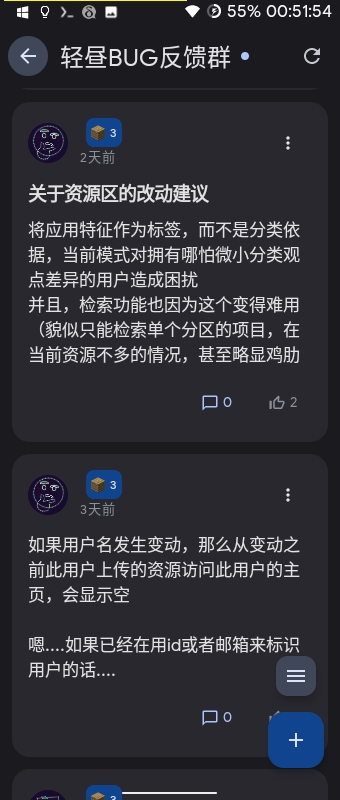
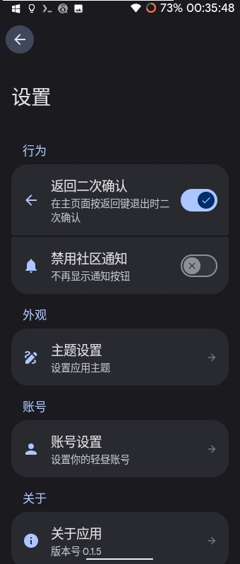

# 轻昼CE

  
  
  
  
  

继承Lua开发的轻昼Ultra，使用Kotlin+Jetpack Compose开发，采用Material You设计，拥有**更快的速度、更小的占用、美观的UI**，且包含诸多实用功能以及社区功能。

---

## 📱 界面预览

  <table>
    <tr>
      <td align="center">  <b>主界面</b></td>
      <td align="center">  <b>会话页面</b></td>
    </tr>
    <tr>
      <td align="center">  <b>资源库页面</b></td>
      <td align="center">  <b>我的页面</b></td>
    </tr>
    <tr>
      <td align="center">  <b>帖子列表页面</b></td>
      <td align="center">  <b>设置页面</b></td>
    </tr>
   </table>

---

## 🛠️ 技术栈

| 类别 | 技术 |
|:---|:---|
| 语言 | Kotlin |
| UI 框架 | Jetpack Compose |
| 设计规范 | Material You |
| 架构 | MVVM |

---

## ✨ 功能特性

| 特性 | 说明 |
|:---|:---|
| ⚡ **极速体验** | 更快的运行速度，流畅不卡顿 |
| 📦 **轻量小巧** | 更小的安装包体积，省空间 |
| 🎨 **Material You** | 美观的现代化界面 |
| 🔧 **实用工具** | 丰富的日常实用功能 |
| 👥 **社区互动** | 内置社区，与用户交流 |

---

## 📦 下载

  

> 前往 [Releases 页面](https://github.com/shijuhao/QingZhouCE/releases) 下载最新 APK

---

## 📄 许可证

### 前端（本仓库）
本项目前端代码采用 [GPL v3](LICENSE) 协议。

- ✅ 自由使用、修改、分发
- ✅ 任何分发必须保持 GPL v3 开源
- ✅ 必须保留版权声明和许可证信息

### 后端服务
后端服务是独立运行的闭源程序，通过 API 与本前端通信。

- 🔒 后端不受 GPL 协议约束
- 🔒 后端代码不在此仓库中
- 🔒 使用本前端时，后端可按任意协议闭源开发

---

## 📧 联系方式

| 方式 | 账号 |
|:---|:---|
| 📨 邮箱 | juhaoluoye@outlook.com |
| ☁️ 云湖 | 3671941 |

---

  ⭐ 如果觉得不错，欢迎 Star 支持！

